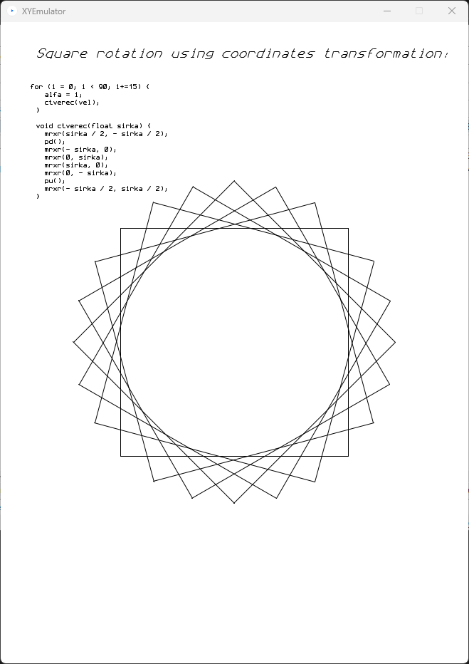

# Plotter simulator/emulator

During the attempts to control the [XY4150](https://blog.3b2.sk/igi/post/Plotter-XY4140-XY4150.aspx "XY4150 plotter") plotter  with [Arduino](https://www.arduino.cc "Arduino") microcontroller board - ["see here"] -  (https://github.com/georger420/ARDUINO-XY4150), it became necessary to have a tool that would be used to debug programs before uploading them to Arduino. It was the reason of creating plotter simulator. As a programming environment the [Processing](https://processing.org "processing") was chosen because the language is similar to Arduino Wiring language.

There are two versions: "XYSimulator" and "XYEmulator". Both serves to intended purposes, but are still in intermediate status.

The first one works almost by the same way like real XY4150 plotter. It includes turtle graphics, but does not include character drawing.

The second one was determined for experiments with characters drawing and with coordinate transformations. Some features of first version was omitted.

In "Examples" subdirectory are examples of programs using "XYSimulator". Here are the outputs:

#### Dragon

#### Rosette

#### Smurf

#### Snowflake

An example of using the "XYEmulator" program is directly in the main program:

## Originaly intended but not yet implemented improvements and features

- The parser of HPGL commands
- The parser of G-CODE commands
- The parser of commands used on ATARI XL/XE for [ALFIGRAF](https://blog.3b2.sk/igi/post/Plotter-ALFI-Alfigraf.aspx "ALFIGRAF"), [MINIGRAF](https://blog.3b2.sk/igi/post/Plotter-Minigraf-ARITMA-0507.aspx "MINIGRAF") and XY4150 plotters.

## Other possible use of the emulator

Simulator / emulator could serve as a virtual periferal device for [Altirra](https://virtualdub.org/altirra.html "Altirra") Atari 8 bit emulator, or perhaps also for [ATARI800](https://atari800.github.io) emulator. 

In case of Altirra it would need either port simulator/emulator into Python, or rewrite Altirra programs "deviceserver.py" and "printer.py" in Altirra "Extras" directory to Processing language.

Atari800 emulator could be connected using "R:" device mapped to net.

